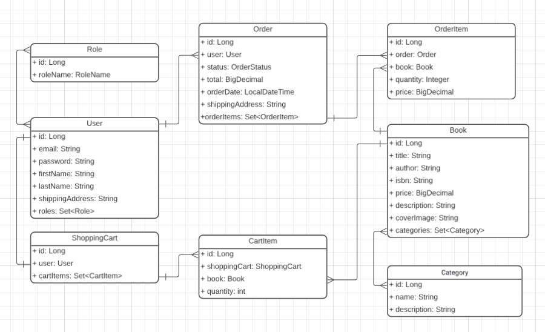

# Online Book Store

A program for buying books. To use the program, you must first register and log in. You will have a shopping cart where you can add books and specify the quantity. You can also complete your purchase, view the total cost, and enter a shipping address.

## Tech Stack

**Java 17**\
**Spring Boot 3.5.9**\
**MySql 9.5.0**\
**Mapstruct 1.5.5.Final**\
**Liquibase 4.31.1**\
**JWT Auth**

## API Reference
```
  User registration and login api: /auth
```
| Method | Endpoint | Description                         |
|:-------|:---------|:------------------------------------|
| `POST` | `/auth/registration` | **Registration new user**           |
| `POST` | `/auth/login` | **Authenticate user** |

```
  Book api: /books
```
| Method   | Endpoint      | Description                       |
|:---------|:--------------| :-------------------------------- |
| `GET`    | `/books`      | **Get all books** |
| `GET`    | `/books/{id}` | **Find book by id** |
| `POST`   | `/books`      | **Create new book** |
| `PUT`    | `/books/{id}` | **Update book** |
| `DELETE` | `/books/{id}` | **Delete book by id** |
```
  Category api: /categories
```
| Method   | Endpoint                 | Description                       |
|:---------|:-------------------------| :-------------------------------- |
| `GET`    | `/categories`            | **Get all categories** |
| `GET`    | `/categories/{id}`       | **Get category by id** |
| `POST`   | `/categories`            | **Create category** |
| `PUT`    | `/categories/{id}`       | **Update category** |
| `DELETE` | `/categories/{id}`       | **Delete category by id"** |
| `GET`    | `/categories/{id}/books` | **Get all books by category"** |
```
  Shopping cart api: /cart
```
| Method   | Endpoint                                         | Description                       |
|:---------|:-------------------------------------------------| :-------------------------------- |
| `GET`    | `/cart`                                          | **Get shopping cart for login user** |
| `POST`   | `/cart`                                          | **Add cart item with id book and quantity** |
| `PUT`    | `/cart/items/{cartItemsId}`                      | **Update cart item** |
| `DELETE` | `/cart/items/{cartItemsId}`                      | **Delete cart item"** |

```
  Order api: /orders
```
| Method   | Endpoint            | Description                       |
|:---------|:--------------------| :-------------------------------- |
| `GET`    | `/orders`           | **Get user order history** |
| `POST`   | `/orders`           | **Create order from shopping cart** |
| `GET`    | `/orders/{orderId}/items`  | **Get all items from order** |
| `GET`    | `{orderId}/items/{id}`      | **Get specific item from order by id** |
| `Patch` | `/orders/{id}`      | **Update order status** |

## Entities Structure



## Environment Variables

To run this project, you will need to add the following environment variables to your .env file\
`MYSQLDB_ROOT_LOGIN=root`\
`MYSQLDB_ROOT_PASSWORD=123`\
`MYSQLDB_DATABASE=books`\
`MYSQLDB_LOCAL_PORT=3307`\
`MYSQLDB_DOCKER_PORT=3306`

`SPRING_LOCAL_PORT=8088`\
`SPRING_DOCKER_PORT=8080`\
`DEBUG_PORT=5005`

Start Containers

`docker compose up --build`